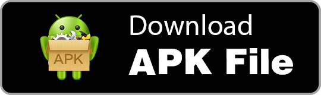
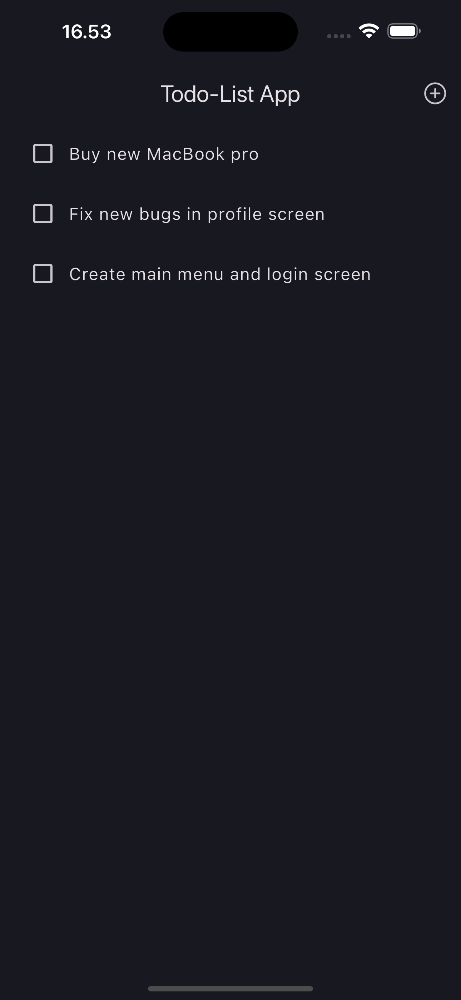
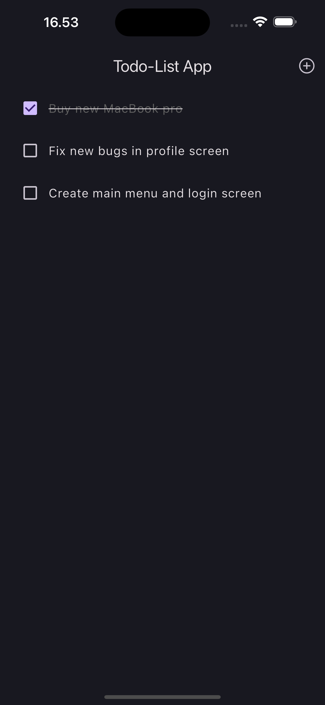
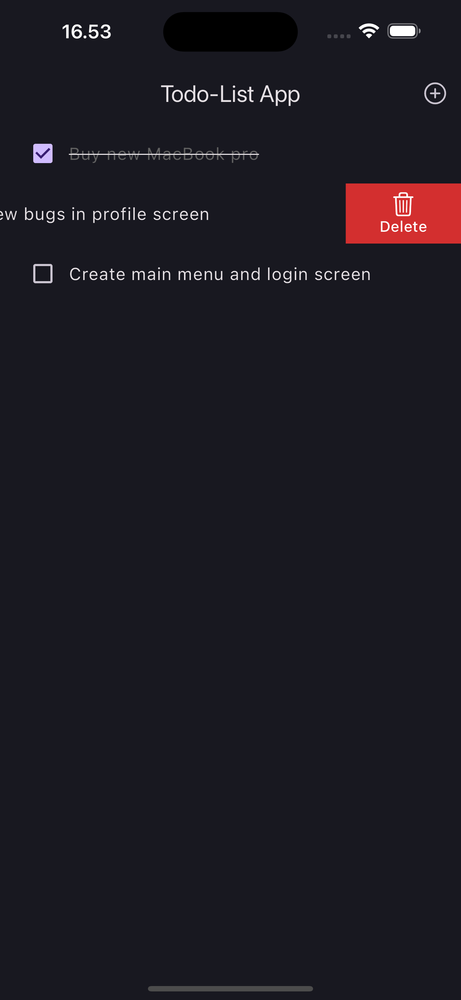
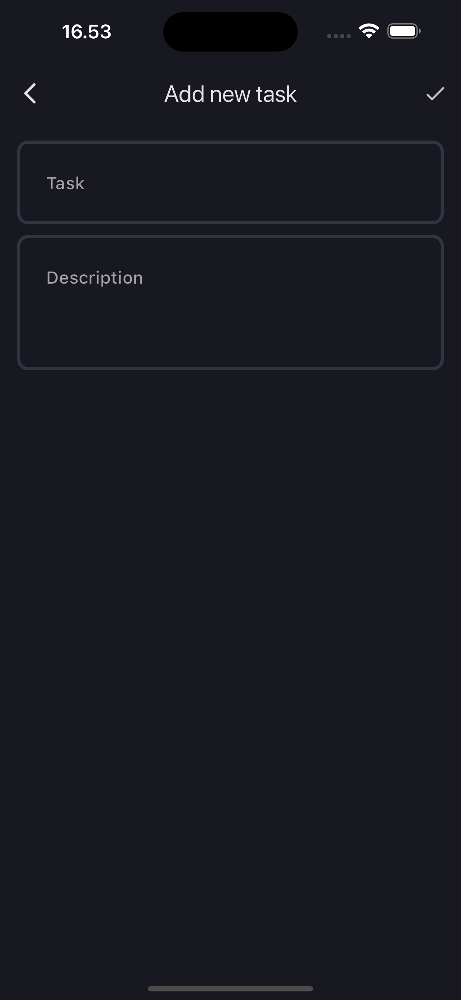
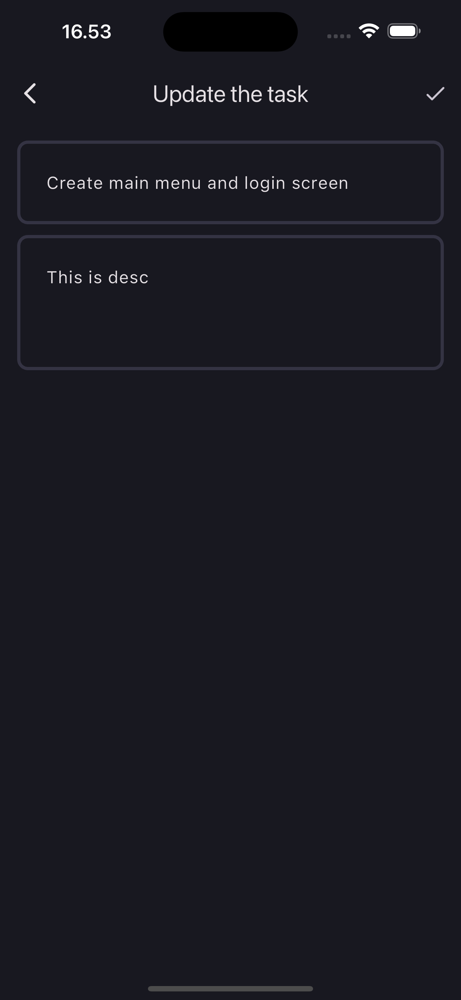
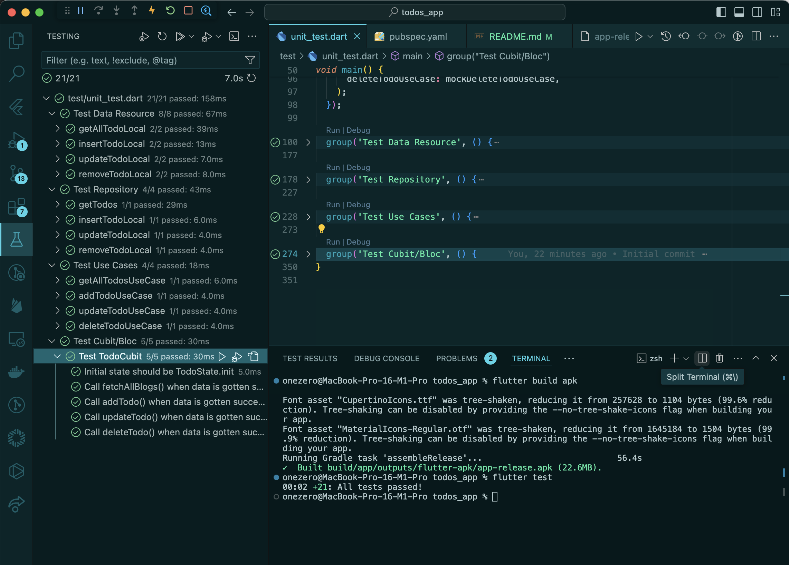

# todos_app

A Todo List Flutter project with Bloc, Clean Achitecture, and ObjectBox.

## Getting Started

This project is a starting point for a Flutter application.

A few resources to get you started if this is your first Flutter project:

- [Lab: Write your first Flutter app](https://docs.flutter.dev/get-started/codelab)
- [Cookbook: Useful Flutter samples](https://docs.flutter.dev/cookbook)

For help getting started with Flutter development, view the
[online documentation](https://docs.flutter.dev/), which offers tutorials,
samples, guidance on mobile development, and a full API reference.

## Try It with Demo Application

<div>
<a href='assets/app_installer.apk' target="_blank"></a>
</div>

## The Sceenshots of Application







## Bonus features:
I have already done some bunus features:

1. [x] Persistence: Save the task list to local storage and retrieve it on app start-up.
2. [x] Validation: Implement input validation to ensure the task description is not empty.
3. [x] UI Polish: Add some animations when adding/deleting tasks for better user experience.
4. [x] Testing: Write a simple unit test for one of the functions (e.g., adding a task, deleting a task).

## Using Flutter BLoC, Clean Architecture, GetIt and ObjectBox

This application utilizes **Flutter BLoC** for state management, **Clean Architecture** for project structure, **GetIt** for depedency injection and **ObjectBox** for local storage.

## File & Folder Structure

There are two different folders. Each of them has own specific function.

1) **src**: Contains the pure Bloc State Management for implement business logic, Data resources, Domain layer, presentation logic and UI widget. And also intelligent dependency injection.
2) **core**: Contains configuration with utilities, extentions, theme style, annotations, and global widgets for the Flutter project.


## Deleting Tasks

To delete a task, you can do so by sliding the task item. like this:


## Testing Result:



### Flutter & Tools Version
* `Flutter 3.19.5`
* `Tools • Dart 3.3.3`
* `Tools • Android SDK 33.0.0`
* `Tools • CocoaPods 1.13.0`

## Instructions to Build and Deploy The App

### Set Up & Running

#### 1. Clone The Github Repo

```bash
$ git clone https://github.com/faisalramdan17/todos_app.git
$ cd todos_app
```

#### 2. Get Packages

```bash
flutter pub get
```

#### 3. Running The App

```bash
flutter run
```

#### 4. Automated Unit Testing

```bash
flutter test
```

### Build and Deploy the App

During a typical development cycle, you test an app using `flutter run` at the command line, or by using the **Run** and **Debug** options in your IDE. By default, Flutter builds a debug version of your app.


## About Me
- Email → faisalramdan.id@gmail.com
- Website → https://codingyourlife.medium.com
- Youtube → https://bit.ly/flutter-free-course
- GitHub → https://github.com/faisalramdan17
- Contact us on Telegram → https://t.me/faisalramdan17
- Facebook → https://www.facebook.com/codingyourlife.id
- Instagram → https://instagram.com/faisalramdan17 & https://instagram.com/codingyourlife.id
- LinkedIn → https://www.linkedin.com/in/faisalramdan17

Thanks so much!


